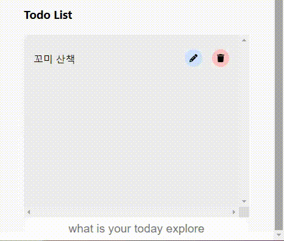
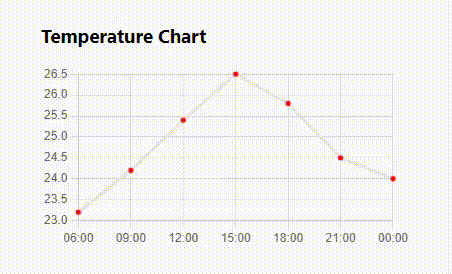

# dribbble 디자인을 참고하여 만든 날씨 어플

## 제작 목표
### 프론트
- CRUD 구현 ✅
- API 활용 ✅
- customHooK 사용 ✅
- Context API 사용하여 state 관리 ✅
- 리팩토링 해보기 ✅
- JWT 방식의 로그인 기능 구현 (미완료)

### 서버
- router 사용하여 코드 깔끔하게 정리

## Stack
- Express
- node.js
- axios
- React
- Context API
- Chart JS

## 구현
- 날씨 정보
- 투두리스트
- 기온별 차트
- 데이터를 가져오는 customHook
- 공통적으로 사용되는 state context API로 관리

작동 모습
- 메인
  

- 투두리스트
  
  

- 기온 차트
  
  
